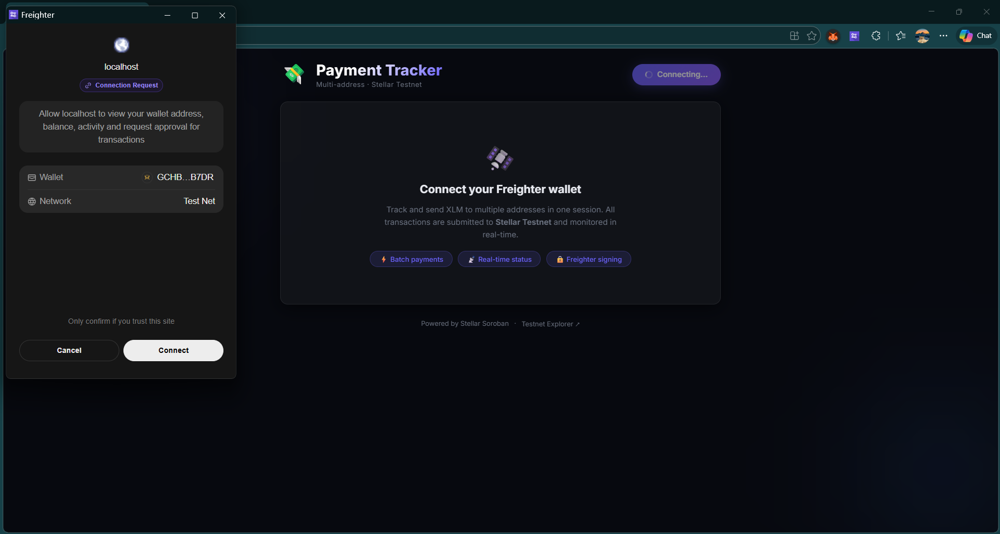

# 💸 Payment Tracker — Stellar Testnet

A multi-address payment tracker dApp built on **Stellar** with **Soroban smart contracts**. Connect your Freighter wallet, add multiple recipients, send batch XLM payments, and watch real-time status updates for every transaction.

> **Level 2 Stellar dApp Challenge** — Multi-wallet app with deployed contract and real-time event integration.

---

## 🌐 Live Demo

> 🔗 **[vercel.link](https://steller-yellow-belt-one.vercel.app/)**

---

## 🖼️ Screenshot — Wallet Options

> Add a screenshot of your wallet connection screen here.



---

## 📋 Deployed Contract

| Field | Value |
|-------|-------|
| **Network** | Stellar Testnet |
| **Contract Address** | `CDFAH2DSKYZUD2ZTL7Z3SQEXMV3FAPYV47JUPX67X7YO7CZDO6J3GXV3` |
| **View on Explorer** | [stellar.expert/explorer/testnet/contract/CDFAH2DSKYZUD2ZTL7Z3SQEXMV3FAPYV47JUPX67X7YO7CZDO6J3GXV3](https://stellar.expert/explorer/testnet/contract/CDFAH2DSKYZUD2ZTL7Z3SQEXMV3FAPYV47JUPX67X7YO7CZDO6J3GXV3) |

---

## 🔁 Contract Call Transaction

| Field | Value |
|-------|-------|
| **Transaction Hash** | `c2ab9ee5762d045f5bb049dfb703407656b9d6061c7f6485bd96a1c922e96fdd` |
| **View on Explorer** | [stellar.expert/explorer/testnet/tx/c2ab9ee5762d045f5bb049dfb703407656b9d6061c7f6485bd96a1c922e96fdd](https://stellar.expert/explorer/testnet/tx/c2ab9ee5762d045f5bb049dfb703407656b9d6061c7f6485bd96a1c922e96fdd) |

> This is the hash of a `register_payment` or `update_status` call made to the deployed contract. After deploying the contract, make a test call from the app and paste the resulting transaction hash here.

---

## ✨ Features

- 🔗 **Freighter wallet integration** — one-click connect/disconnect
- 📋 **Multi-address payments** — add unlimited recipients in a single session
- 🚀 **Batch send** — submit all pending payments sequentially
- 📡 **Real-time status updates** — live polling of Soroban RPC contract events
- ⏳ **Live status badges** — Pending → Sending → ✅ Success / ❌ Failed
- 🛑 **3 error types handled** (see below)
- 🔍 **StellarExpert links** — click to view any transaction on the testnet explorer

---

## 🛑 Error Handling

| # | Error Type | Trigger |
|---|------------|---------|
| 1 | **Wallet Not Found** | Freighter extension not installed or access denied |
| 2 | **User Rejected** | User dismisses the signing popup |
| 3 | **Insufficient Balance** | XLM balance too low for the requested payment |

---

## 🦀 Smart Contract

Written with the **Soroban Rust SDK** — source at [`contracts/payment_tracker/src/lib.rs`](contracts/payment_tracker/src/lib.rs).

### Functions
| Function | Description |
|----------|-------------|
| `register_payment(id, sender, recipient, amount)` | Records a payment on-chain; emits `PYMNT_REG` event |
| `update_status(id, caller, new_status)` | Updates status to `Pending`, `Completed`, or `Failed`; emits `STAT_UPD` event |
| `get_payment(id)` | Read-only lookup of a payment record |

### Contract Error Types
| Code | Name | When |
|------|------|------|
| 1 | `NotFound` | Payment ID doesn't exist |
| 2 | `AlreadyExists` | Payment ID already registered |
| 3 | `Unauthorized` | Caller ≠ original sender |

---

## 🚀 Getting Started

### Prerequisites
- [Node.js](https://nodejs.org/) v18+
- [Freighter wallet](https://www.freighter.app/) browser extension (set to **Testnet**)

### Install & Run

```bash
git clone https://github.com/Runavphate/Stellar-Project.git
cd Stellar-Project
npm install
npm start
```

The app runs at **https://localhost:3000** (HTTPS is required for Freighter).

### Build for Production

```bash
npm run build
```

---

## 📁 Project Structure

```
stellar-wallet/
├── contracts/
│   └── payment_tracker/
│       ├── Cargo.toml
│       └── src/lib.rs            # Soroban smart contract
├── src/
│   ├── components/
│   │   ├── PaymentTracker.jsx    # Main UI component
│   │   └── Freighter.js          # Wallet helpers
│   ├── hooks/
│   │   ├── usePaymentTracker.js  # Core wallet + payment state hook
│   │   └── useContractEvents.js  # Real-time Soroban event polling
│   ├── App.js
│   └── App.css                   # Dark glassmorphism UI styles
└── package.json
```

---

## 🔗 Resources

- [Stellar Testnet Explorer](https://stellar.expert/explorer/testnet)
- [Soroban Documentation](https://developers.stellar.org/docs/build/smart-contracts)
- [Freighter Wallet](https://www.freighter.app/)
- [Stellar Horizon API](https://developers.stellar.org/api/horizon)

---

## 📜 License

MIT
